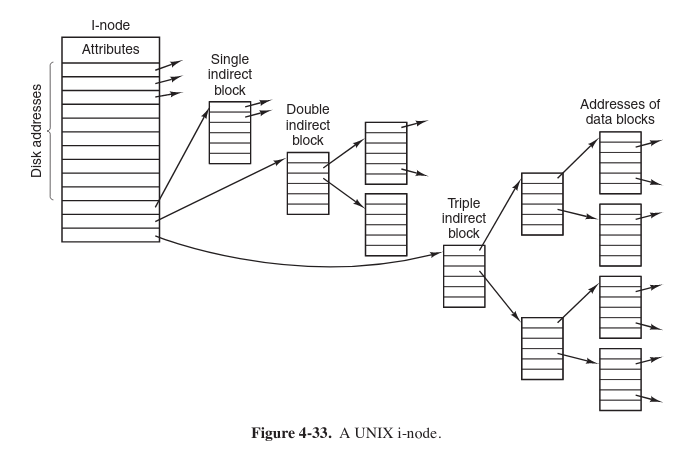
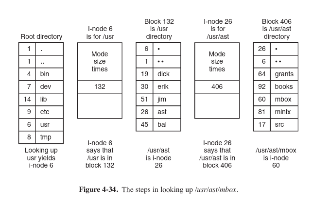
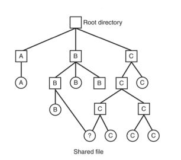
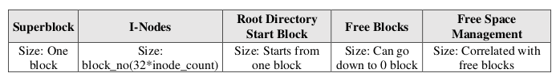

# os-unix-like-file-system

## Design
A unix-like file system that uses i-nodes blocks and data blocks to keep the files. I-node
structure like the *Figure 1* below (single link, double link and triple link i-nodes).


  

*Figure1 - Modern Operating Systems by Andrew S. Tanenbaum*  

The directory, i-node block,
data block structure is shown in *Figure 2*. File attributes include size, last
modification date and time, and name of the file.  

  

*Figure2 - Modern Operating Systems by Andrew S. Tanenbaum*  

**An example directory DAG:**  
  

*Figure3 - Modern Operating Systems by Andrew S. Tanenbaum*  


**Layout of the file system is given below**  
  

*Figure4*  
## Commands
```
fileSystemOper fileSystem.data list “/”
```  

lists the contents of the root directory. The output will
be like ls –l

```
fileSystemOper fileSystem.data mkdir “/usr/ysa”
```
Makes a new directory under the directory “ysa” if
possible. These two works exactly like mkdir and
rmdir commands of Linux shell


```
fileSystemOper fileSystem.data dumpe2fs
```
works like simplified and modified Linux dumpe2fs
command. It will list block count, i-node count, free
block and i-nodes, number of files and directories, and
block size. Different from regular dumpe2fs, this
command lists all the occupied i-nodes, blocks and the
file names for each of them.


```
fileSystemOper fileSystem.data write “/usr/ysa/file” linuxFile
```
Creates a file named file under “/usr/ysa” in your
file system, then copies the contents of the Linux file
into the new file. This works very similar to Linux
copy command.


```
fileSystemOper fileSystem.data read “/usr/ysa/file” linuxFile
```
Reads the file named file under “/usr/ysa” in your
file system, then writes this data to the Linux file. This
again works very similar to Linux copy command.


```
fileSystemOper fileSystem.data del “/usr/ysa/file”
```
Deletes the file named file under “/usr/ysa” in
your file system. This again works very similar to
Linux del command.


```
fileSystemOper fileSystem.data ln “/usr/ysa/file1” “/usr/ysa/file2”
```
Allows more than one filename to refer to the same
file
Linux ln command


```
fileSystemOper fileSystem.data lnsym “/usr/ysa/file1” “/usr/ysa/file2”
```
Linux ln-s command

## Build & Test
Test case trying to fill the data blocks   
```
bash test1.sh
```
Test case to delete the only created file.  
```
bash test2.sh
```  

Outputs contain many information about the layout after the operations issued which helps to get an understanding of the linux file system.
